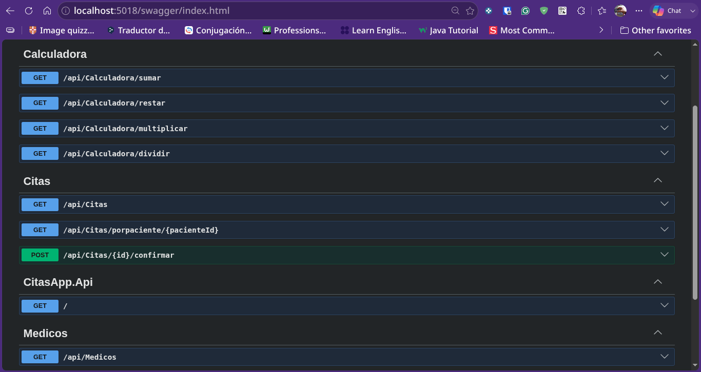
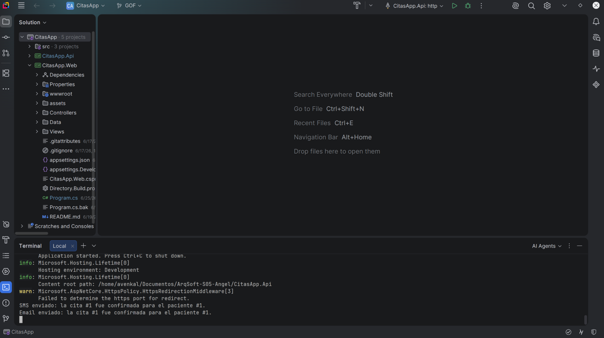
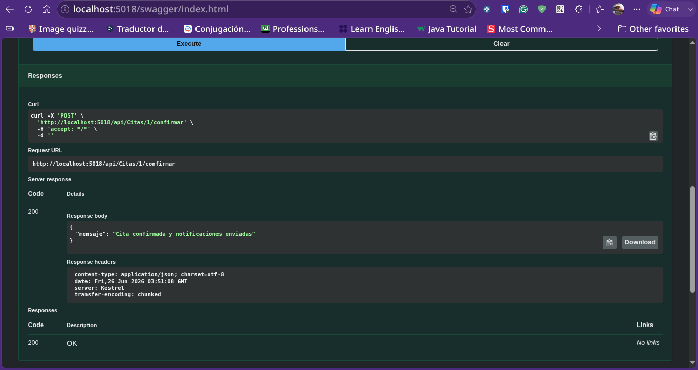

# CitasApp - Sistema de Gestión de Citas Médicas con Observer

Este proyecto es una aplicación web desarrollada con **C#, ASP.NET Core MVC y .NET 10**. Su objetivo principal es administrar citas médicas de manera sencilla, permitiendo consultar pacientes, médicos y citas dentro de una agenda básica.

El proyecto también incluye una **API REST separada**, servicios de aplicación, modelos de dominio, interfaces, repositorios y la implementación del patrón **Observer** para enviar notificaciones cuando una cita es confirmada.

Actualmente, la aplicación Web MVC trabaja principalmente con archivos **CSV** ubicados en `wwwroot/data`, mientras que el proyecto `CitasApp.Api` utiliza archivos **JSON** ubicados en su carpeta `Data`.

Además, el reto implementado agrega un sistema de notificaciones donde `CitaService` confirma una cita y notifica a los observers registrados, sin depender directamente de clases de `Infrastructure`.

---

## 👤 Datos del Estudiante

| Campo | Información |
| :--- | :--- |
| **Nombre** | Angel Abraham Lugo Saenz |
| **Matrícula** | SW2409052 |
| **Universidad** | Tecnológico de Software |
| **Profesor** | Jorge Javier Pedroza Romero |
| **Materia** | Arquitectura de Software |
| **Tarea** | Sistema de citas médicas en ASP.NET Core MVC, API REST y patrón Observer |

---

## 📝 Descripción General

CitasApp es un sistema de citas médicas donde se pueden administrar tres elementos principales:

* Pacientes.
* Médicos.
* Citas médicas.

La aplicación permite registrar pacientes, registrar médicos, crear citas, consultar la agenda general y confirmar citas desde la API. Cada cita se relaciona con un paciente y con un médico mediante sus identificadores.

El proyecto está organizado en varias capas para separar mejor las responsabilidades del sistema:

* **CitasApp.Web:** aplicación principal con MVC, Razor Views y panel de pruebas.
* **CitasApp.Api:** API REST separada para consultar datos y confirmar citas mediante endpoints.
* **CitasApp.Domain:** modelos, interfaces principales y la interfaz `ICitaObserver`.
* **CitasApp.Application:** servicios de aplicación, incluyendo `CitaService`.
* **CitasApp.Infrastructure:** repositorios para CSV, JSON y SQLite, además de los observers concretos `SmsObserver` y `EmailObserver`.

Las restricciones principales del proyecto son:

* Las citas deben estar relacionadas con un paciente registrado.
* Las citas deben estar relacionadas con un médico registrado.
* Los pacientes, médicos y citas pueden consultarse desde la aplicación Web.
* La Web MVC usa repositorios CSV como persistencia activa.
* La API separada usa repositorios JSON.
* Los repositorios SQLite quedan disponibles como opción de persistencia local.
* La lógica de acceso a datos se maneja mediante interfaces.
* La agenda muestra los nombres de pacientes y médicos usando sus IDs.
* El servicio de citas puede confirmar una cita.
* Al confirmar una cita se cambia el estado a `Confirmada`.
* Al confirmar una cita se notifican los observers registrados.
* `CitaService` no importa ningún namespace de `Infrastructure`.

---

## 🚀 Tecnologías Utilizadas

* **Lenguaje:** C#
* **Framework Web:** ASP.NET Core MVC
* **API:** ASP.NET Core Web API
* **Versión de .NET:** .NET 10
* **Vistas:** Razor Views
* **Frontend:** HTML, CSS, JavaScript y Bootstrap
* **Persistencia:** CSV, JSON y SQLite
* **Base local opcional:** SQLite con `Microsoft.Data.Sqlite`
* **Documentación visual de API:** Swagger con `Swashbuckle.AspNetCore`
* **Patrón implementado:** Observer
* **Arquitectura:** Separación por capas
* **Principio aplicado:** Inversión de dependencias
* **IDE recomendado:** JetBrains Rider
* **Sistema compatible:** Arch Linux
* **Herramientas:** .NET SDK, Git y GitHub

---

## 🧱 Retos del Proyecto

Durante el desarrollo se presentaron varios retos importantes:

* Organizar el proyecto separando Web, API, dominio, aplicación e infraestructura.
* Crear modelos para representar pacientes, médicos y citas.
* Crear interfaces para no depender directamente de una sola forma de almacenamiento.
* Implementar repositorios para archivos CSV.
* Implementar repositorios para archivos JSON.
* Agregar repositorios SQLite como alternativa de persistencia.
* Hacer que los controladores MVC usaran repositorios mediante inyección de dependencias.
* Crear una API separada usando servicios de aplicación.
* Mostrar nombres de pacientes y médicos en lugar de mostrar solamente sus IDs.
* Crear vistas Razor para listar, agregar y consultar registros.
* Agregar un panel de pruebas con JavaScript para consultar endpoints GET.
* Mantener la estructura del proyecto funcionando con varios `.csproj`.
* Separar los archivos de datos usados por la Web y por la API.
* Mantener el proyecto compatible con .NET 10 en Arch Linux.
* Implementar el patrón Observer para notificar cuando una cita sea confirmada.
* Crear la interfaz `ICitaObserver` dentro de la capa Domain.
* Implementar `SmsObserver` y `EmailObserver` dentro de Infrastructure.
* Modificar `CitaService` para manejar una lista de observers.
* Evitar que `CitaService` importe namespaces de Infrastructure.
* Agregar el método `Actualizar` en los repositorios de citas.
* Agregar un endpoint `POST` para confirmar una cita desde la API.
* Configurar Swagger para probar visualmente los endpoints desde el navegador.

---

## 📂 Estructura del Proyecto

```text
ArqSoft-S05-Angel/
│
├── Program.cs
├── CitasApp.Web.csproj
├── CitasApp.sln
├── CitasApp.slnx
├── Directory.Build.props
├── appsettings.json
├── appsettings.Development.json
│
├── Controllers/
│   ├── HomeController.cs
│   ├── PacienteController.cs
│   ├── MedicoController.cs
│   ├── CitaController.cs
│   ├── ApiPacientesController.cs
│   ├── ApiMedicosController.cs
│   ├── ApiCitasController.cs
│   └── CalculadoraController.cs
│
├── Views/
│   ├── Home/
│   │   ├── Index.cshtml
│   │   └── Privacy.cshtml
│   │
│   ├── Paciente/
│   │   ├── Index.cshtml
│   │   ├── Create.cshtml
│   │   └── Detalle.cshtml
│   │
│   ├── Medico/
│   │   ├── Index.cshtml
│   │   ├── Create.cshtml
│   │   └── Detalle.cshtml
│   │
│   ├── Cita/
│   │   ├── Index.cshtml
│   │   ├── Create.cshtml
│   │   └── PorPaciente.cshtml
│   │
│   └── Shared/
│       ├── _Layout.cshtml
│       ├── Error.cshtml
│       └── _ValidationScriptsPartial.cshtml
│
├── wwwroot/
│   ├── css/
│   │   ├── site.css
│   │   └── panel-pruebas.css
│   │
│   ├── js/
│   │   ├── site.js
│   │   └── panel-pruebas.js
│   │
│   ├── lib/
│   └── data/
│       ├── pacientes.csv
│       ├── medicos.csv
│       └── citas.csv
│
├── Data/
│   ├── Pacientes.json
│   ├── Medicos.json
│   ├── Citas.json
│   └── DatosJson.cs
│
├── src/
│   ├── CitasApp.Domain/
│   │   ├── Models/
│   │   │   ├── Paciente.cs
│   │   │   ├── Medico.cs
│   │   │   ├── Cita.cs
│   │   │   ├── CitaJson.cs
│   │   │   └── ErrorViewModel.cs
│   │   │
│   │   └── Interfaces/
│   │       ├── IPacienteRepository.cs
│   │       ├── IMedicoRepository.cs
│   │       ├── ICitaRepository.cs
│   │       └── ICitaObserver.cs
│   │
│   ├── CitasApp.Application/
│   │   └── Services/
│   │       ├── PacienteService.cs
│   │       ├── MedicoService.cs
│   │       └── CitaService.cs
│   │
│   └── CitasApp.Infrastructure/
│       ├── Repositories/
│       │   ├── JsonPacienteRepository.cs
│       │   ├── JsonMedicoRepository.cs
│       │   ├── JsonCitaRepository.cs
│       │   ├── CsvPacienteRepository.cs
│       │   ├── CsvMedicoRepository.cs
│       │   ├── CsvCitaRepository.cs
│       │   ├── SqlitePacienteRepository.cs
│       │   ├── SqliteMedicoRepository.cs
│       │   └── SqliteCitaRepository.cs
│       │
│       └── Observers/
│           ├── SmsObserver.cs
│           └── EmailObserver.cs
│
├── CitasApp.Api/
│   ├── Program.cs
│   ├── CitasApp.Api.csproj
│   ├── Controllers/
│   │   ├── PacientesController.cs
│   │   ├── MedicosController.cs
│   │   ├── CitasController.cs
│   │   └── CalculadoraController.cs
│   │
│   └── Data/
│       ├── Pacientes.json
│       ├── Medicos.json
│       └── Citas.json
│
├── assets/
│   ├── 1.png
│   ├── 2.png
│   └── 3.png
│
└── README.md
```

---

## 🔌 Nueva Organización: Web MVC, API, Repositorios y Observer

El proyecto no solamente tiene una aplicación MVC, también incluye una API separada, una capa de infraestructura para manejar distintos tipos de almacenamiento y un sistema de notificaciones basado en el patrón **Observer**.

La idea general es que el sistema no dependa directamente de un solo archivo, base de datos o clase concreta, sino de interfaces que pueden ser implementadas por distintos repositorios u observers.

### Flujo principal de la Web MVC

```text
Vistas Razor
    ↓
Controladores MVC
    ↓
Interfaces del dominio
    ↓
Repositorios CSV
    ↓
wwwroot/data
```

La aplicación Web MVC usa actualmente archivos CSV:

```text
wwwroot/data/pacientes.csv
wwwroot/data/medicos.csv
wwwroot/data/citas.csv
```

### Flujo principal de la API

```text
Endpoints API
    ↓
Servicios de aplicación
    ↓
Interfaces del dominio
    ↓
Repositorios JSON
    ↓
Data
```

La API separada usa archivos JSON:

```text
CitasApp.Api/Data/Pacientes.json
CitasApp.Api/Data/Medicos.json
CitasApp.Api/Data/Citas.json
```

### Flujo del patrón Observer

```text
POST /api/Citas/{id}/confirmar
    ↓
CitasController
    ↓
CitaService
    ↓
ICitaRepository.Actualizar(cita)
    ↓
ICitaObserver.Notificar(cita)
    ↓
SmsObserver y EmailObserver
```

### Repositorios disponibles

```text
CSV:
- CsvPacienteRepository.cs
- CsvMedicoRepository.cs
- CsvCitaRepository.cs

JSON:
- JsonPacienteRepository.cs
- JsonMedicoRepository.cs
- JsonCitaRepository.cs

SQLite:
- SqlitePacienteRepository.cs
- SqliteMedicoRepository.cs
- SqliteCitaRepository.cs
```

### Observers disponibles

```text
Observer:
- ICitaObserver.cs

Implementaciones:
- SmsObserver.cs
- EmailObserver.cs
```

---

## 🧩 Reto Observer

El reto consistió en agregar un sistema de notificaciones cuando una cita médica sea confirmada.

Para lograrlo se creó una interfaz en la capa Domain:

```text
src/CitasApp.Domain/Interfaces/ICitaObserver.cs
```

Después se implementaron dos observers en la capa Infrastructure:

```text
src/CitasApp.Infrastructure/Observers/SmsObserver.cs
src/CitasApp.Infrastructure/Observers/EmailObserver.cs
```

También se modificó `CitaService` para recibir una colección de observers:

```text
IEnumerable<ICitaObserver>
```

De esta manera, cuando se confirma una cita, el servicio cambia el estado de la cita a `Confirmada`, actualiza la información en el repositorio y notifica a todos los observers registrados.

### ¿Cómo se evita importar Infrastructure en CitaService?

`CitaService` no importa `Infrastructure` porque solo depende de la interfaz `ICitaObserver`, ubicada en `CitasApp.Domain`.

Las clases concretas `SmsObserver` y `EmailObserver` viven en `CitasApp.Infrastructure`, pero se conectan en `Program.cs` mediante inyección de dependencias.

Esto aplica el principio de inversión de dependencias:

```text
Application depende de Domain
Infrastructure depende de Domain
Application no depende de Infrastructure
```

La conexión real se hace en `CitasApp.Api/Program.cs`:

```text
ICitaObserver → SmsObserver
ICitaObserver → EmailObserver
```

---

## ⚙️ Funcionalidades

### Gestión de pacientes

Permite visualizar pacientes registrados, agregar nuevos pacientes y consultar el detalle de cada paciente.

### Gestión de médicos

Permite visualizar médicos disponibles, agregar nuevos médicos y consultar información como especialidad y número de licencia.

### Gestión de citas

Permite consultar la agenda general de citas médicas, mostrando fecha, hora, paciente, médico, motivo y estado.

### Agregar cita

Permite crear una nueva cita seleccionando un paciente, un médico, una fecha, una hora, un motivo y un estado.

### Confirmar cita

Permite confirmar una cita desde la API mediante un endpoint `POST`.

Al confirmar una cita:

```text
1. Se busca la cita por su ID.
2. Se cambia el estado a Confirmada.
3. Se actualiza la cita en el repositorio.
4. Se notifican los observers registrados.
5. Se muestra una respuesta indicando que la cita fue confirmada.
```

Endpoint usado:

```text
POST /api/Citas/{id}/confirmar
```

Ejemplo:

```bash
curl -X POST http://localhost:5018/api/Citas/1/confirmar
```

Respuesta esperada:

```json
{
  "mensaje": "Cita confirmada y notificaciones enviadas"
}
```

### Notificaciones

El sistema cuenta con dos observers:

```text
SmsObserver
EmailObserver
```

Cuando una cita se confirma, ambos observers reciben la cita y muestran un mensaje de notificación en la consola de la API.

Ejemplo de salida en consola:

```text
SMS enviado: la cita #1 fue confirmada para el paciente #1.
Email enviado: la cita #1 fue confirmada para el paciente #1.
```

### Citas por paciente

Permite consultar las citas relacionadas con un paciente específico.

### Panel de pruebas

La página principal funciona como un panel para probar endpoints GET de la API interna de la Web MVC.

Desde este panel se pueden probar:

```text
/api/pacientes
/api/pacientes/{id}

/api/medicos
/api/medicos/{id}

/api/citas
/api/citas/por-paciente/{pacienteId}

/api/calculadora/sumar
/api/calculadora/restar
/api/calculadora/multiplicar
/api/calculadora/dividir
```

### Calculadora API

Se agregó una calculadora sencilla para probar endpoints GET con parámetros.

Operaciones disponibles:

```text
sumar
restar
multiplicar
dividir
```

### Swagger

La API separada puede visualizarse desde el navegador usando Swagger.

Ruta principal:

```text
http://localhost:5018/swagger/index.html
```

Desde Swagger se pueden probar visualmente los endpoints de la API, incluyendo:

```text
POST /api/Citas/{id}/confirmar
```

---

## ❓ ¿De qué trata?

El proyecto trata de una aplicación para administrar citas médicas. La idea principal es registrar pacientes y médicos, para después crear citas relacionadas con ambos.

La aplicación funciona como una agenda médica sencilla donde se puede consultar quién tiene una cita, con qué médico, en qué fecha, a qué hora, por qué motivo y con qué estado.

También se agregó una API para consultar datos desde endpoints, además de un panel visual que permite probar rutas desde el navegador sin usar herramientas externas.

En el reto final se agregó el patrón **Observer**, para que al confirmar una cita se puedan enviar notificaciones simuladas por SMS y Email.

---

## 🧩 ¿Qué hicimos?

Se creó una aplicación de citas médicas organizada en varias partes:

```text
- Se crearon los modelos Paciente, Medico, Cita y CitaJson.
- Se crearon interfaces para pacientes, médicos y citas.
- Se creó la interfaz ICitaObserver para el patrón Observer.
- Se creó la capa Domain para modelos e interfaces.
- Se creó la capa Application para servicios.
- Se modificó CitaService para confirmar citas y notificar observers.
- Se creó la capa Infrastructure para repositorios y observers.
- Se agregaron repositorios CSV para pacientes, médicos y citas.
- Se agregaron repositorios JSON para pacientes, médicos y citas.
- Se agregaron repositorios SQLite como alternativa de almacenamiento.
- Se agregó el método Actualizar en ICitaRepository.
- Se implementó Actualizar en CsvCitaRepository.
- Se implementó Actualizar en JsonCitaRepository.
- Se implementó Actualizar en SqliteCitaRepository.
- Se creó SmsObserver.
- Se creó EmailObserver.
- Se configuró Program.cs de la Web para usar CSV.
- Se configuró Program.cs de la API para usar JSON.
- Se registraron SmsObserver y EmailObserver mediante inyección de dependencias.
- Se crearon controladores MVC para pacientes, médicos y citas.
- Se crearon controladores API dentro de la Web para el panel de pruebas.
- Se creó una API separada en CitasApp.Api.
- Se agregó el endpoint POST /api/Citas/{id}/confirmar.
- Se agregaron servicios PacienteService, MedicoService y CitaService.
- Se crearon vistas Razor para listar, agregar y consultar detalles.
- Se agregó navegación principal en _Layout.cshtml.
- Se agregaron archivos CSV dentro de wwwroot/data.
- Se agregaron archivos JSON dentro de Data.
- Se creó un panel de pruebas usando HTML, CSS y JavaScript.
- Se configuró Swagger para probar endpoints desde el navegador.
- Se agregaron estilos personalizados para la interfaz.
- Se agregaron capturas de evidencia dentro de assets.
```

---

## ▶️ ¿Cómo funciona?

```text
1. La aplicación Web inicia desde Program.cs.
2. Program.cs registra los repositorios CSV mediante inyección de dependencias.
3. Los controladores MVC reciben las interfaces de los repositorios.
4. El usuario entra a las secciones de Pacientes, Médicos o Citas.
5. Cada controlador consulta la información desde su repositorio.
6. Los repositorios CSV leen los archivos ubicados en wwwroot/data.
7. Las vistas Razor muestran la información en tablas o formularios.
8. Para crear una cita, se selecciona un paciente y un médico ya registrados.
9. Al guardar una cita, el repositorio genera un nuevo ID.
10. La información se escribe nuevamente en el archivo CSV correspondiente.
11. El panel de pruebas usa JavaScript para hacer peticiones fetch a los endpoints.
12. La API separada trabaja con servicios de aplicación y repositorios JSON.
13. Para confirmar una cita se usa el endpoint POST /api/Citas/{id}/confirmar.
14. CitasController llama a CitaService.
15. CitaService busca la cita por ID.
16. CitaService cambia el estado de la cita a Confirmada.
17. CitaService actualiza la cita usando ICitaRepository.
18. CitaService recorre su lista de observers.
19. SmsObserver muestra una notificación simulada por SMS.
20. EmailObserver muestra una notificación simulada por Email.
```

---

## 🛠️ Comandos de Uso

### Restaurar dependencias

Como la carpeta contiene más de un proyecto, es recomendable usar la solución directamente:

```bash
dotnet restore CitasApp.sln
```

---

### Limpiar el proyecto

```bash
dotnet clean CitasApp.sln
```

---

### Compilar el proyecto

```bash
dotnet build CitasApp.sln
```

---

### Ejecutar la aplicación Web MVC

Desde la carpeta principal del proyecto:

```bash
dotnet run --project CitasApp.Web.csproj
```

También se puede ejecutar así si ya estás dentro de la carpeta del proyecto y quieres correr la Web:

```bash
dotnet run --project CitasApp.Web.csproj
```

---

### Ejecutar la API separada

```bash
dotnet run --project CitasApp.Api/CitasApp.Api.csproj
```

Para forzar el puerto usado durante la prueba:

```bash
dotnet run --project CitasApp.Api/CitasApp.Api.csproj --urls "http://localhost:5018"
```

---

### Probar la API desde terminal

Verificar que la API está funcionando:

```bash
curl http://localhost:5018/
```

Consultar citas:

```bash
curl http://localhost:5018/api/Citas
```

Confirmar cita:

```bash
curl -X POST http://localhost:5018/api/Citas/1/confirmar
```

Respuesta esperada:

```json
{
  "mensaje": "Cita confirmada y notificaciones enviadas"
}
```

---

### Ver Swagger en el navegador

Con la API corriendo, abrir:

```text
http://localhost:5018/swagger/index.html
```

Desde ahí se puede probar visualmente:

```text
POST /api/Citas/{id}/confirmar
```

---

### Rutas principales de la Web MVC

```text
Página principal / Panel de pruebas:
http://localhost:PUERTO/

Agenda de citas:
http://localhost:PUERTO/Cita

Agregar cita:
http://localhost:PUERTO/Cita/Create

Lista de pacientes:
http://localhost:PUERTO/Paciente

Lista de médicos:
http://localhost:PUERTO/Medico
```

---

### Rutas principales de la API separada

```text
http://localhost:5018/
http://localhost:5018/swagger/index.html

http://localhost:5018/api/Pacientes
http://localhost:5018/api/Pacientes/1

http://localhost:5018/api/Medicos
http://localhost:5018/api/Medicos/1

http://localhost:5018/api/Citas
http://localhost:5018/api/Citas/porpaciente/1
http://localhost:5018/api/Citas/1/confirmar

http://localhost:5018/api/Calculadora/sumar?a=10&b=5
http://localhost:5018/api/Calculadora/restar?a=10&b=5
http://localhost:5018/api/Calculadora/multiplicar?a=10&b=5
http://localhost:5018/api/Calculadora/dividir?a=10&b=5
```

---

## 🧪 Gestión con Git

```bash
# Ver en qué rama estás
git branch

# Ver archivos modificados
git status

# Agregar cambios
git add .

# Crear commit
git commit -m "Implementa patron Observer para notificaciones de citas"

# Ver remoto
git remote -v

# Subir cambios
git push
```

Si es la primera vez que subes la rama:

```bash
git push -u origin nombre-de-tu-rama
```

---

## 🖥️ Uso en JetBrains Rider

```text
1. Abre JetBrains Rider.
2. Selecciona Open.
3. Abre la carpeta ArqSoft-S05-Angel.
4. También puedes abrir CitasApp.sln.
5. Espera a que Rider restaure las dependencias.
6. Selecciona el proyecto CitasApp.Web para ejecutar la aplicación MVC.
7. Selecciona el proyecto CitasApp.Api si quieres ejecutar la API separada.
8. Si quieres probar Observer, ejecuta CitasApp.Api.
9. Abre http://localhost:5018/swagger/index.html en el navegador.
10. Busca POST /api/Citas/{id}/confirmar.
11. Presiona Try it out.
12. Escribe el ID de una cita.
13. Presiona Execute.
14. Revisa la respuesta en Swagger.
15. Revisa la consola de Rider para ver las notificaciones de SMS y Email.
```

---

## 🐧 Requisitos en Arch Linux

Instalar el SDK de .NET:

```bash
sudo pacman -S dotnet-sdk
```

Verificar la instalación:

```bash
dotnet --list-sdks
dotnet --list-runtimes
```

El proyecto está configurado para:

```xml
<TargetFramework>net10.0</TargetFramework>
```

Por eso se necesita tener instalado un SDK compatible con **.NET 10**.

---

## 📸 Evidencias de Ejecución

En esta sección se muestran capturas del proyecto funcionando correctamente en el navegador.

### ✅ Página principal / END POINTS

En esta captura se muestra la página principal de CitasApp. Esta pantalla funciona como panel para probar endpoints de pacientes, médicos, citas y calculadora.



---

### 📅 Comprobacion por terminal del GOF

En esta imagen se muestra la sección de agenda de citas. La tabla presenta la fecha, hora, paciente, médico, motivo, estado y un enlace para ver las citas asociadas al paciente.



---

### ➕ Visualización en la página web ✅

En esta captura se observa el formulario para agregar una nueva cita médica. El sistema permite seleccionar paciente, médico, fecha, hora, motivo y estado antes de guardar.



---

### 🔔 Confirmación de cita con Observer

En esta parte se puede agregar una captura de Swagger o de la terminal mostrando que el endpoint confirmó la cita correctamente.

Ruta recomendada para la evidencia:

```text
http://localhost:5018/swagger/index.html
```

Endpoint probado:

```text
POST /api/Citas/{id}/confirmar
```

Respuesta obtenida:

```json
{
  "mensaje": "Cita confirmada y notificaciones enviadas"
}
```

---

## 🖌️ Personalización y Diseño

El proyecto usa vistas Razor con HTML, CSS y Bootstrap. También se agregaron estilos personalizados para que la interfaz se vea más trabajada.

El archivo principal de estilos de la aplicación MVC es:

```text
wwwroot/css/site.css
```

El panel de pruebas usa su propio archivo:

```text
wwwroot/css/panel-pruebas.css
```

El JavaScript del panel de pruebas está en:

```text
wwwroot/js/panel-pruebas.js
```

Elementos visuales del proyecto:

```text
- Barra de navegación superior.
- Tablas para mostrar pacientes, médicos y citas.
- Formularios para registrar información.
- Enlaces para ver detalles.
- Panel de pruebas para consumir endpoints.
- Swagger para probar visualmente la API REST.
- Diseño oscuro con colores verdes, naranjas y morados.
- Estilos personalizados en CSS.
```

---

## 💻 Códigos Importantes

### Configuración principal de la Web MVC

En `Program.cs` se configura la carpeta de datos y se registran los repositorios CSV:

```csharp
var dataFolder = Path.Combine(builder.Environment.WebRootPath, "data");
Directory.CreateDirectory(dataFolder);

var csvPacientes = Path.Combine(dataFolder, "pacientes.csv");
var csvMedicos = Path.Combine(dataFolder, "medicos.csv");
var csvCitas = Path.Combine(dataFolder, "citas.csv");

builder.Services.AddControllersWithViews();

builder.Services.AddSingleton<IPacienteRepository>(_ => new CsvPacienteRepository(csvPacientes));
builder.Services.AddSingleton<IMedicoRepository>(_ => new CsvMedicoRepository(csvMedicos));
builder.Services.AddSingleton<ICitaRepository>(_ => new CsvCitaRepository(csvCitas));
```

---

### Ruta principal de la aplicación MVC

```csharp
app.MapControllerRoute(
    name: "default",
    pattern: "{controller=Home}/{action=Index}/{id?}");
```

---

### Registro de endpoints API dentro de la Web

```csharp
app.MapControllers();
```

Esto permite usar rutas como:

```text
/api/pacientes
/api/medicos
/api/citas
/api/calculadora
```

---

### Configuración de la API separada

En `CitasApp.Api/Program.cs` se registran los repositorios JSON, los services de aplicación, Swagger y los observers:

```csharp
builder.Services.AddControllers();
builder.Services.AddEndpointsApiExplorer();
builder.Services.AddSwaggerGen();

builder.Services.AddScoped<IPacienteRepository, JsonPacienteRepository>();
builder.Services.AddScoped<IMedicoRepository, JsonMedicoRepository>();
builder.Services.AddScoped<ICitaRepository, JsonCitaRepository>();

builder.Services.AddScoped<ICitaObserver, SmsObserver>();
builder.Services.AddScoped<ICitaObserver, EmailObserver>();

builder.Services.AddScoped<PacienteService>();
builder.Services.AddScoped<MedicoService>();
builder.Services.AddScoped<CitaService>();
```

---

### Activación de Swagger

```csharp
app.UseSwagger();
app.UseSwaggerUI();
```

Esto permite abrir la documentación visual de la API desde:

```text
http://localhost:5018/swagger/index.html
```

---

### Interfaz del Observer

En `ICitaObserver.cs` se define la abstracción que usarán los observers:

```csharp
using CitasApp.Models;

namespace CitasApp.Interfaces
{
    public interface ICitaObserver
    {
        void Notificar(Cita cita);
    }
}
```

---

### Observer para SMS

```csharp
using CitasApp.Interfaces;
using CitasApp.Models;

namespace CitasApp.Observers
{
    public class SmsObserver : ICitaObserver
    {
        public void Notificar(Cita cita)
        {
            Console.WriteLine($"SMS enviado: la cita #{cita.Id} fue confirmada para el paciente #{cita.PacienteId}.");
        }
    }
}
```

---

### Observer para Email

```csharp
using CitasApp.Interfaces;
using CitasApp.Models;

namespace CitasApp.Observers
{
    public class EmailObserver : ICitaObserver
    {
        public void Notificar(Cita cita)
        {
            Console.WriteLine($"Email enviado: la cita #{cita.Id} fue confirmada para el paciente #{cita.PacienteId}.");
        }
    }
}
```

---

### Servicio de citas con Observer

En `CitaService.cs` se concentra la lógica para obtener citas, agregar citas y confirmar citas:

```csharp
public class CitaService
{
    private readonly ICitaRepository _citaRepository;
    private readonly List<ICitaObserver> _observers;

    public CitaService(ICitaRepository citaRepository, IEnumerable<ICitaObserver> observers)
    {
        _citaRepository = citaRepository;
        _observers = observers.ToList();
    }

    public List<Cita> ObtenerTodos()
    {
        return _citaRepository.ObtenerTodos();
    }

    public List<Cita> ObtenerPorPaciente(int pacienteId)
    {
        return _citaRepository.ObtenerPorPaciente(pacienteId);
    }

    public void Agregar(Cita cita)
    {
        _citaRepository.Agregar(cita);
    }

    public bool Confirmar(int citaId)
    {
        var cita = _citaRepository.ObtenerTodos()
            .FirstOrDefault(c => c.Id == citaId);

        if (cita == null)
        {
            return false;
        }

        cita.Estado = "Confirmada";

        _citaRepository.Actualizar(cita);

        NotificarObservers(cita);

        return true;
    }

    private void NotificarObservers(Cita cita)
    {
        foreach (var observer in _observers)
        {
            observer.Notificar(cita);
        }
    }
}
```

---

### Repositorio de citas actualizado

La interfaz `ICitaRepository` ahora incluye el método `Actualizar`:

```csharp
using CitasApp.Models;

namespace CitasApp.Interfaces
{
    public interface ICitaRepository
    {
        List<Cita> ObtenerTodos();
        List<Cita> ObtenerPorPaciente(int pacienteId);
        void Agregar(Cita cita);
        void Actualizar(Cita cita);
    }
}
```

Este método se usa cuando se confirma una cita para guardar el nuevo estado:

```text
Pendiente → Confirmada
```

---

### Endpoint para confirmar cita

En `CitasApp.Api/Controllers/CitasController.cs` se agregó el endpoint:

```csharp
[HttpPost("{id}/confirmar")]
public IActionResult Confirmar(int id)
{
    var confirmado = _citaService.Confirmar(id);

    if (!confirmado)
    {
        return NotFound(new
        {
            mensaje = "No se encontró la cita"
        });
    }

    return Ok(new
    {
        mensaje = "Cita confirmada y notificaciones enviadas"
    });
}
```

---

### Agregar una cita desde MVC

En `CitaController.cs`, el método `Create` recibe la cita desde el formulario y la guarda mediante el repositorio:

```csharp
[HttpPost]
[ValidateAntiForgeryToken]
public IActionResult Create(Cita cita)
{
    if (!ModelState.IsValid)
    {
        CargarPacientesYMedicos();
        return View(cita);
    }

    _citaRepo.Agregar(cita);
    return RedirectToAction(nameof(Index));
}
```

---

### Cargar pacientes y médicos en las vistas

```csharp
private void CargarPacientesYMedicos()
{
    ViewBag.Pacientes = _pacienteRepo.ObtenerTodos();
    ViewBag.Medicos = _medicoRepo.ObtenerTodos();
}
```

Esto permite que el formulario de citas pueda mostrar pacientes y médicos en listas desplegables.

---

### Mostrar nombres en lugar de IDs

En la vista `Views/Cita/Index.cshtml`, la cita busca el paciente y el médico usando sus identificadores:

```csharp
var paciente = pacientes?.FirstOrDefault(p => p.Id == c.PacienteId);
var medico = medicos?.FirstOrDefault(m => m.Id == c.MedicoId);
```

Así la tabla puede mostrar el nombre completo en lugar de mostrar solamente el ID.

---

### Buscar citas por paciente desde la Web API interna

```csharp
[HttpGet("por-paciente/{pacienteId:int}")]
[HttpGet("porpaciente/{pacienteId:int}")]
public IActionResult BuscarPorPaciente(int pacienteId)
{
    var citas = _repo.ObtenerPorPaciente(pacienteId);

    if (citas.Count == 0)
    {
        return NotFound(new
        {
            mensaje = "No se encontraron citas para ese paciente"
        });
    }

    return Ok(citas);
}
```

---

### JavaScript del panel de pruebas

El archivo `panel-pruebas.js` usa `fetch` para consumir endpoints:

```javascript
async function pedirDatos(url, salidaId, statusId) {
    const salida = document.getElementById(salidaId);
    const status = document.getElementById(statusId);

    salida.textContent = "Cargando...";
    status.textContent = "-";

    try {
        const respuesta = await fetch(url);
        const texto = await respuesta.text();

        let datos;

        try {
            datos = JSON.parse(texto);
        } catch {
            datos = texto;
        }

        status.textContent = respuesta.status;

        salida.textContent = typeof datos === "string"
            ? datos
            : JSON.stringify(datos, null, 2);

    } catch (error) {
        status.textContent = "Error";
        salida.textContent = error.message;
    }
}
```

---

## ✅ Validación de Entrada

El proyecto usa formularios MVC para capturar información de pacientes, médicos y citas.

La información capturada es:

```text
Paciente:
- Nombre
- Apellido
- Email
- Teléfono

Médico:
- Nombre
- Apellido
- Especialidad
- Número de licencia

Cita:
- Paciente
- Médico
- Fecha
- Hora
- Motivo
- Estado
```

En los métodos `Create` se utiliza:

```csharp
[ValidateAntiForgeryToken]
```

También se revisa el estado del modelo con:

```csharp
if (!ModelState.IsValid)
{
    return View(modelo);
}
```

Como mejora futura, se pueden agregar anotaciones como:

```csharp
[Required]
[EmailAddress]
[StringLength]
```

Esto ayudaría a evitar registros vacíos o información incorrecta.

---

## 📁 Manejo de Datos

### Web MVC

La aplicación Web MVC usa CSV como persistencia activa.

Archivos usados:

```text
wwwroot/data/pacientes.csv
wwwroot/data/medicos.csv
wwwroot/data/citas.csv
```

Ejemplo de flujo:

```text
Formulario MVC
    ↓
Controlador MVC
    ↓
Repositorio CSV
    ↓
Archivo .csv
```

---

### API separada

La API separada usa JSON como persistencia activa.

Archivos usados:

```text
CitasApp.Api/Data/Pacientes.json
CitasApp.Api/Data/Medicos.json
CitasApp.Api/Data/Citas.json
```

Ejemplo de flujo:

```text
Petición HTTP
    ↓
Controlador API
    ↓
Servicio de aplicación
    ↓
Repositorio JSON
    ↓
Archivo .json
```

---

### SQLite

También existen repositorios SQLite:

```text
SqlitePacienteRepository.cs
SqliteMedicoRepository.cs
SqliteCitaRepository.cs
```

Estos permiten que el proyecto pueda adaptarse a una base de datos local en lugar de depender de archivos CSV o JSON.

---

### Observer

El patrón Observer no guarda datos directamente, sino que reacciona cuando una cita es confirmada.

Ejemplo de flujo:

```text
Cita confirmada
    ↓
CitaService
    ↓
Lista de ICitaObserver
    ↓
SmsObserver
EmailObserver
```

---

## 📈 Mejoras Futuras

```text
[ ] Unificar la persistencia para que la Web MVC y la API usen la misma fuente de datos.

[ ] Decidir si el proyecto principal usará CSV, JSON o SQLite como almacenamiento final.

[ ] Activar SQLite como repositorio principal cuando se quiera trabajar con base de datos local.

[ ] Agregar validaciones con Data Annotations en los modelos.

[ ] Evitar registros vacíos en pacientes, médicos y citas.

[ ] Agregar edición de pacientes.

[ ] Agregar eliminación de pacientes.

[ ] Agregar edición de médicos.

[ ] Agregar eliminación de médicos.

[ ] Agregar edición de citas.

[ ] Agregar eliminación de citas.

[ ] Crear una vista de detalle individual para cada cita.

[ ] Mejorar la validación de fechas y horas.

[ ] Evitar citas duplicadas para el mismo médico en la misma fecha y hora.

[ ] Agregar mensajes visuales cuando se guarde un registro correctamente.

[ ] Agregar confirmación de citas desde la Web MVC.

[ ] Mostrar visualmente el estado Confirmada después de usar el endpoint.

[ ] Crear observers reales para enviar SMS y Email usando servicios externos.

[ ] Agregar historial de notificaciones.

[ ] Evitar notificar dos veces si una cita ya estaba confirmada.

[ ] Documentar mejor la diferencia entre CitasApp.Web y CitasApp.Api.

[ ] Limpiar archivos temporales como bin, obj o respaldos .bak antes de subir a GitHub.
```

---

## 🏁 Conclusión

Este proyecto permitió aplicar conceptos de arquitectura de software en una aplicación web real usando ASP.NET Core MVC, Web API, servicios, interfaces, repositorios y el patrón Observer.

La aplicación permite administrar pacientes, médicos y citas médicas de forma sencilla. Además, se agregó una organización por capas para separar los modelos, la lógica de aplicación y la infraestructura de datos.

Con el reto Observer, el sistema ahora puede confirmar una cita y ejecutar notificaciones simuladas por SMS y Email. Esto se logró sin que `CitaService` dependiera directamente de `Infrastructure`, ya que el servicio trabaja con la interfaz `ICitaObserver` ubicada en `Domain`.

Aunque el sistema todavía puede mejorar, especialmente en la unificación de la persistencia entre la Web MVC y la API, la base principal ya permite trabajar con una agenda médica funcional, consultar información desde vistas Razor, probar endpoints mediante un panel web y confirmar citas desde la API.

---

## Cláusula de IA

```text
Yo, Angel Abraham Lugo Saenz, declaro que utilicé IA como apoyo para redactar y organizar este README, explicar con mayor claridad la estructura del proyecto, revisar la comunicación entre capas y documentar el funcionamiento general de CitasApp.

El código, la estructura del proyecto, la implementación del patrón Observer y las decisiones principales fueron trabajadas como parte de la actividad escolar de Arquitectura de Software.
```
