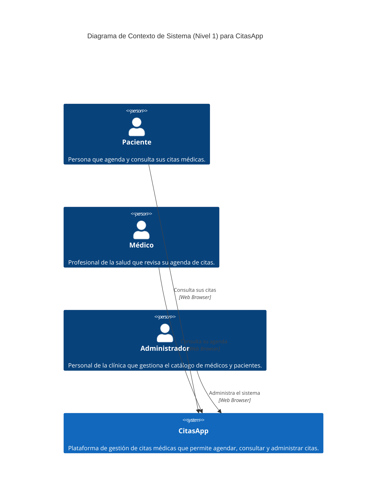
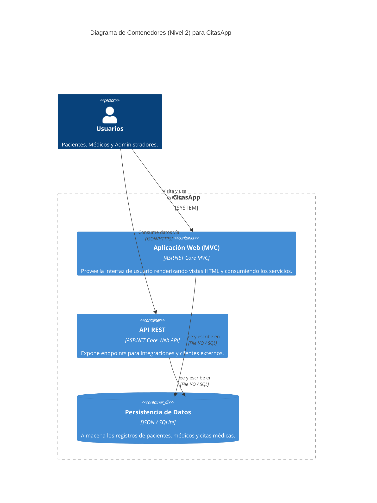

# Documentación de Arquitectura (Modelo C4)

Esta documentación describe la arquitectura completa del proyecto **CitasApp** utilizando el Modelo C4, estructurada en 3 niveles de abstracción.

---

## 1. C4 Nivel 1 — Contexto

**Para quién es:** Para todo el equipo (incluyendo personas no técnicas, área de negocio y usuarios finales).  
**Qué pregunta responde:** ¿Cuál es el panorama general? ¿Quién usa el sistema y qué valor principal provee?

---

## 2. C4 Nivel 2 — Contenedores

**Para quién es:** Para el equipo técnico, arquitectos de software y desarrolladores.  
**Qué pregunta responde:** ¿Cuáles son las grandes piezas técnicas que conforman el sistema, de qué tecnologías están hechas y cómo se comunican entre sí?

