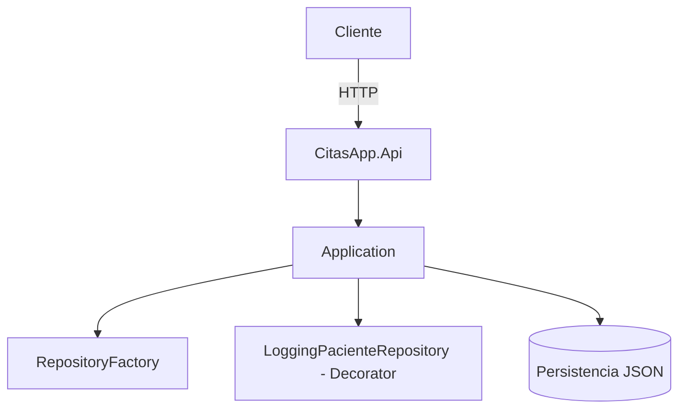
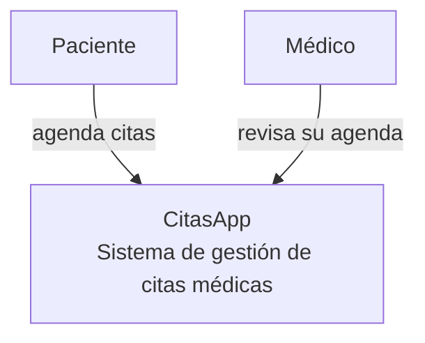
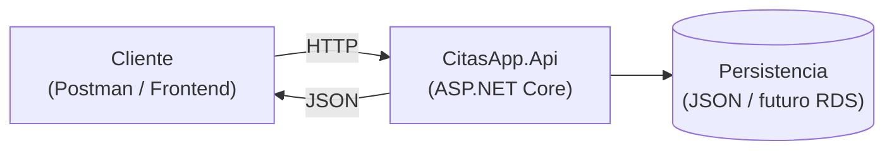
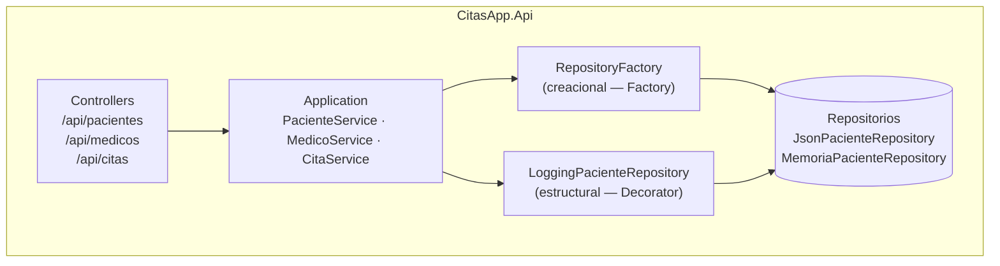

# Diagramas de Arquitectura — CitasApp

**Alumno:** Josue Enmanuel Poot Mateo  
**Materia:** Arquitectura de Software  

---

## Flujo General

Visión simplificada del recorrido de una petición desde el cliente hasta la capa de persistencia, pasando por los patrones GoF implementados.

---

## C4 Nivel 1 — Contexto

Quién usa el sistema y para qué. No aparecen tecnologías ni detalles internos.

---

## C4 Nivel 2 — Contenedores

Las piezas técnicas grandes: la API, cómo se comunica y dónde persiste.

---

## C4 Nivel 3 — Componentes dentro de CitasApp.Api

Descomposición interna: controllers, capa de aplicación y patrones GoF.

